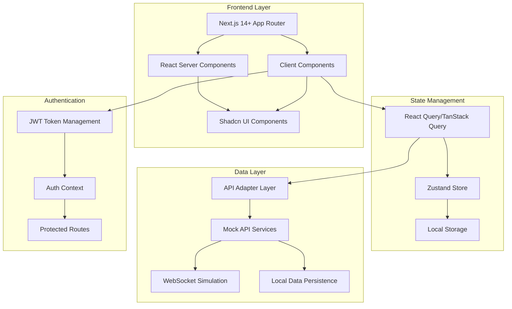

# Design Document

## Overview

The WhatsApp Business Dashboard is a modern, responsive web application built with Next.js 14+ that provides businesses with comprehensive tools for managing customer communications, analyzing engagement metrics, and executing marketing campaigns. The application follows a component-based architecture using React Server Components (RSC) and leverages Shadcn UI components for consistent design patterns.

The system architecture emphasizes real-time data simulation, responsive design, and user experience optimization while maintaining the familiar WhatsApp interface paradigm that users expect.

## Architecture

### High-Level Architecture



### Technology Stack

- **Framework**: Next.js 14+ with App Router
- **Language**: TypeScript
- **Styling**: Tailwind CSS v4 with Shadcn UI components
- **State Management**: Zustand + React Query (TanStack Query)
- **Authentication**: JWT with custom auth context
- **Charts**: Recharts for analytics visualization
- **Icons**: Lucide React
- **Form Validation**: Zod with React Hook Form
- **Real-time Simulation**: Polling with React Query + WebSocket simulation
- **PWA**: Next.js PWA plugin with service workers
- **API Layer**: Adapter Pattern for seamless backend integration

### API Architecture Strategy

The architecture implements an **Adapter Pattern** for API calls, allowing easy switching between `MockApiService` (for development/demo) and `RealApiService` (connecting to the FastAPI backend) without changing UI components. This design ensures:

- **Development Flexibility**: Full functionality during development with mock data
- **Future Migration**: Seamless transition to FastAPI backend integration
- **Testing Isolation**: Independent testing of UI components and API logic
- **Deployment Options**: Can deploy as standalone demo or integrated system

```typescript
// API Adapter Interface
interface ApiAdapter {
  auth: AuthApi;
  contacts: ContactsApi;
  messages: MessagesApi;
  campaigns: CampaignsApi;
  analytics: AnalyticsApi;
}

// Implementation switching
const apiService: ApiAdapter = process.env.NODE_ENV === 'production' 
  ? new RealApiService(process.env.FASTAPI_URL)
  : new MockApiService();
```

## Components and Interfaces

### Core Layout Structure

```
src/
├── app/
│   ├── (auth)/
│   │   ├── login/
│   │   └── layout.tsx
│   ├── (dashboard)/
│   │   ├── analytics/
│   │   ├── chat/
│   │   ├── contacts/
│   │   ├── campaigns/
│   │   ├── templates/
│   │   └── layout.tsx
│   ├── globals.css
│   ├── layout.tsx
│   └── page.tsx
├── components/
│   ├── ui/ (Shadcn components)
│   ├── auth/
│   ├── dashboard/
│   ├── chat/
│   ├── contacts/
│   ├── campaigns/
│   ├── templates/
│   └── layout/
├── lib/
│   ├── auth.ts
│   ├── api.ts
│   ├── utils.ts
│   ├── validations.ts
│   └── constants.ts
├── hooks/
│   ├── useAuth.ts
│   ├── useRealtime.ts
│   └── useLocalStorage.ts
├── stores/
│   ├── authStore.ts
│   ├── chatStore.ts
│   └── contactsStore.ts
└── types/
    ├── auth.ts
    ├── chat.ts
    ├── contacts.ts
    └── campaigns.ts
```

### Key Component Interfaces

#### Authentication Components
- `LoginForm`: JWT-based authentication with Zod validation
- `AuthProvider`: Context provider for authentication state
- `ProtectedRoute`: Route guard component

#### Dashboard Components
- `DashboardLayout`: Main layout with sidebar navigation
- `StatsCards`: Real-time metrics display
- `AnalyticsCharts`: Interactive charts using Recharts
- `RecentActivity`: Live activity feed

#### Chat Components
- `ChatLayout`: Two-pane layout (contacts + chat)
- `ContactsList`: Scrollable contact list with search
- `ChatArea`: Message display with bubbles and status
- `MessageInput`: Text input with media upload
- `MessageBubble`: Individual message component with status indicators

#### CRM Components
- `ContactsTable`: Data table with sorting/filtering
- `ContactForm`: Add/edit contact modal
- `BulkActions`: Multi-select operations
- `TagManager`: Contact tagging system

#### Campaign Components
- `CampaignWizard`: Step-by-step campaign creation
- `TemplateSelector`: Template browsing and selection
- `RecipientSelector`: Contact group selection
- `CampaignProgress`: Real-time sending simulation

#### Template Components
- `TemplatesList`: Searchable template library
- `TemplateEditor`: Template creation/editing
- `TemplatePreview`: Template preview with variables

## Data Models

### Core Data Types

```typescript
// Authentication
interface User {
  id: string;
  email: string;
  name: string;
  role: 'admin' | 'agent' | 'manager';
  avatar?: string;
}

interface AuthState {
  user: User | null;
  token: string | null;
  isAuthenticated: boolean;
}

// Contacts
interface Contact {
  id: string;
  name: string;
  phone: string;
  email?: string;
  avatar?: string;
  tags: string[];
  lastMessageDate: Date;
  messageCount: number;
  status: 'active' | 'inactive' | 'blocked';
  createdAt: Date;
  updatedAt: Date;
}

// Messages
interface Message {
  id: string;
  contactId: string;
  content: string;
  type: 'text' | 'image' | 'document';
  direction: 'inbound' | 'outbound';
  status: 'sent' | 'delivered' | 'read' | 'failed';
  timestamp: Date;
  mediaUrl?: string;
  mediaName?: string;
}

// Conversations
interface Conversation {
  id: string;
  contactId: string;
  messages: Message[];
  lastMessage: Message;
  unreadCount: number;
  isActive: boolean;
}

// Templates
interface Template {
  id: string;
  name: string;
  content: string;
  category: string;
  variables: string[];
  usage: number;
  createdAt: Date;
  updatedAt: Date;
}

// Campaigns
interface Campaign {
  id: string;
  name: string;
  templateId: string;
  recipients: string[];
  status: 'draft' | 'sending' | 'completed' | 'failed';
  scheduledAt?: Date;
  sentAt?: Date;
  deliveryStats: {
    sent: number;
    delivered: number;
    failed: number;
    total: number;
  };
  createdAt: Date;
}

// Analytics
interface DashboardStats {
  activeChats: number;
  messagesSent: number;
  messagesDelivered: number;
  responseRate: number;
  avgResponseTime: number;
}

interface ChartData {
  date: string;
  sent: number;
  delivered: number;
  read: number;
}
```

### State Management Architecture

```typescript
// Zustand Stores
interface AuthStore {
  user: User | null;
  token: string | null;
  login: (credentials: LoginCredentials) => Promise<void>;
  logout: () => void;
  refreshToken: () => Promise<void>;
}

interface ChatStore {
  conversations: Conversation[];
  activeConversation: string | null;
  setActiveConversation: (id: string) => void;
  sendMessage: (message: Omit<Message, 'id' | 'timestamp'>) => void;
  markAsRead: (conversationId: string) => void;
}

interface ContactsStore {
  contacts: Contact[];
  selectedContacts: string[];
  filters: ContactFilters;
  setFilters: (filters: ContactFilters) => void;
  addContact: (contact: Omit<Contact, 'id' | 'createdAt' | 'updatedAt'>) => void;
  updateContact: (id: string, updates: Partial<Contact>) => void;
  deleteContacts: (ids: string[]) => void;
}
```

## Error Handling

### Error Handling Strategy

1. **API Error Interceptor**: Centralized error handling for all API calls
2. **Toast Notifications**: User-friendly error messages using Shadcn Toast
3. **Error Boundaries**: React error boundaries for component-level error handling
4. **Form Validation**: Zod schemas for client-side validation
5. **Network Error Handling**: Retry mechanisms and offline detection

### Error Types and Responses

```typescript
interface ApiError {
  code: string;
  message: string;
  details?: any;
}

// Error Handler Implementation
class ErrorHandler {
  static handleApiError(error: ApiError) {
    switch (error.code) {
      case 'NETWORK_ERROR':
        toast.error('Network connection failed. Please check your internet connection.');
        break;
      case 'AUTH_EXPIRED':
        toast.error('Session expired. Please log in again.');
        // Redirect to login
        break;
      case 'VALIDATION_ERROR':
        toast.error('Please check your input and try again.');
        break;
      default:
        toast.error('An unexpected error occurred. Please try again.');
    }
  }
}
```

### Form Validation Schemas

```typescript
// Zod Validation Schemas
const loginSchema = z.object({
  email: z.string().email('Invalid email address'),
  password: z.string().min(6, 'Password must be at least 6 characters'),
});

const contactSchema = z.object({
  name: z.string().min(1, 'Name is required'),
  phone: z.string().regex(/^\+?[\d\s-()]+$/, 'Invalid phone number'),
  email: z.string().email().optional(),
  tags: z.array(z.string()).default([]),
});

const messageSchema = z.object({
  content: z.string().min(1, 'Message cannot be empty'),
  type: z.enum(['text', 'image', 'document']),
});
```

## Testing Strategy

### Testing Approach

1. **Unit Tests**: Jest + React Testing Library for component testing
2. **Integration Tests**: API integration and user flow testing
3. **E2E Tests**: Playwright for critical user journeys
4. **Visual Regression**: Chromatic for UI consistency
5. **Performance Tests**: Lighthouse CI for performance monitoring

### Key Testing Areas

- Authentication flow and JWT handling
- Real-time data updates and polling
- Form validation and error handling
- Chat interface functionality
- Campaign creation and execution
- Contact management operations
- Responsive design across devices
- Dark mode theme switching
- PWA functionality

### Mock Data Strategy

```typescript
// Mock API Implementation
class MockApiService {
  // Simulate network delays
  private delay = (ms: number) => new Promise(resolve => setTimeout(resolve, ms));
  
  // Mock real-time updates
  private simulateRealtime() {
    setInterval(() => {
      // Update stats, new messages, etc.
      this.broadcastUpdate();
    }, 5000);
  }
  
  // WebSocket simulation
  private broadcastUpdate() {
    // Emit events to subscribers
    eventEmitter.emit('stats-update', newStats);
    eventEmitter.emit('new-message', newMessage);
  }
}
```

## Performance Optimization

### Optimization Strategies

1. **Code Splitting**: Route-based and component-based code splitting
2. **Image Optimization**: Next.js Image component with lazy loading
3. **Caching**: React Query caching for API responses
4. **Virtual Scrolling**: For large contact lists and message histories
5. **Debounced Search**: Optimized search functionality
6. **Memoization**: React.memo and useMemo for expensive operations

### Real-time Data Simulation

```typescript
// Polling Strategy with React Query
const useRealTimeStats = () => {
  return useQuery({
    queryKey: ['dashboard-stats'],
    queryFn: fetchDashboardStats,
    refetchInterval: 5000, // Poll every 5 seconds
    staleTime: 4000, // Consider data stale after 4 seconds
  });
};

// WebSocket Simulation
class WebSocketSimulator {
  private listeners: Map<string, Function[]> = new Map();
  
  subscribe(event: string, callback: Function) {
    if (!this.listeners.has(event)) {
      this.listeners.set(event, []);
    }
    this.listeners.get(event)!.push(callback);
  }
  
  emit(event: string, data: any) {
    const callbacks = this.listeners.get(event) || [];
    callbacks.forEach(callback => callback(data));
  }
}
```

## Security Considerations

### Security Implementation

1. **JWT Token Management**: Secure token storage and refresh logic
2. **Input Sanitization**: XSS prevention for user inputs
3. **CSRF Protection**: Token-based CSRF protection
4. **Content Security Policy**: Strict CSP headers
5. **Rate Limiting**: Client-side rate limiting for API calls

### Authentication Flow

```typescript
// JWT Auth Implementation
class AuthService {
  private tokenKey = 'whatsapp-dashboard-token';
  
  async login(credentials: LoginCredentials): Promise<AuthResponse> {
    const response = await api.post('/auth/login', credentials);
    const { token, user } = response.data;
    
    // Store token securely
    localStorage.setItem(this.tokenKey, token);
    
    return { token, user };
  }
  
  async refreshToken(): Promise<string> {
    const currentToken = this.getToken();
    if (!currentToken) throw new Error('No token available');
    
    const response = await api.post('/auth/refresh', { token: currentToken });
    const { token } = response.data;
    
    localStorage.setItem(this.tokenKey, token);
    return token;
  }
}
```

## Functional Features Implementation

### Authentication System

```typescript
// Enhanced Auth Store with Persistence
interface AuthStore {
  user: User | null;
  token: string | null;
  isAuthenticated: boolean;
  login: (email: string, password: string) => Promise<void>;
  logout: () => void;
  checkAuth: () => boolean;
}

// Auth Store Implementation with Zustand Persist
const useAuthStore = create<AuthStore>()(
  persist(
    (set, get) => ({
      user: null,
      token: null,
      isAuthenticated: false,
      
      login: async (email: string, password: string) => {
        // Accept any email/password combination
        const fakeToken = `fake-jwt-token-${Date.now()}`;
        const fakeUser = {
          id: '1',
          email,
          name: email.split('@')[0],
          role: 'admin' as const
        };
        
        set({ 
          user: fakeUser, 
          token: fakeToken, 
          isAuthenticated: true 
        });
      },
      
      logout: () => {
        set({ user: null, token: null, isAuthenticated: false });
      },
      
      checkAuth: () => {
        const { token } = get();
        return !!token;
      }
    }),
    {
      name: 'auth-storage',
      partialize: (state) => ({ 
        user: state.user, 
        token: state.token, 
        isAuthenticated: state.isAuthenticated 
      })
    }
  )
);

// Auth Guard Component
const AuthGuard: React.FC<{ children: React.ReactNode }> = ({ children }) => {
  const { isAuthenticated, checkAuth } = useAuthStore();
  const router = useRouter();
  
  useEffect(() => {
    if (!checkAuth()) {
      router.push('/login');
    }
  }, [checkAuth, router]);
  
  if (!isAuthenticated) {
    return <div>Redirecting to login...</div>;
  }
  
  return <>{children}</>;
};
```

### Interactive Contact Management

```typescript
// Enhanced Contacts Store
interface ContactsStore {
  contacts: Contact[];
  addContact: (contact: Omit<Contact, 'id' | 'createdAt' | 'updatedAt'>) => void;
  updateContact: (id: string, updates: Partial<Contact>) => void;
  deleteContact: (id: string) => void;
}

const useContactsStore = create<ContactsStore>((set, get) => ({
  contacts: mockContacts, // Initial mock data
  
  addContact: (contactData) => {
    const newContact: Contact = {
      ...contactData,
      id: `contact-${Date.now()}`,
      createdAt: new Date(),
      updatedAt: new Date(),
      messageCount: 0,
      lastMessageDate: new Date(),
      status: 'active'
    };
    
    set((state) => ({
      contacts: [...state.contacts, newContact]
    }));
  },
  
  updateContact: (id, updates) => {
    set((state) => ({
      contacts: state.contacts.map(contact =>
        contact.id === id 
          ? { ...contact, ...updates, updatedAt: new Date() }
          : contact
      )
    }));
  },
  
  deleteContact: (id) => {
    set((state) => ({
      contacts: state.contacts.filter(contact => contact.id !== id)
    }));
  }
}));

// Add Contact Form Integration
const AddContactForm: React.FC = () => {
  const { addContact } = useContactsStore();
  const [isOpen, setIsOpen] = useState(false);
  
  const onSubmit = (data: ContactFormData) => {
    try {
      addContact(data);
      setIsOpen(false);
      toast.success(`Contact ${data.name} added successfully`);
    } catch (error) {
      toast.error('Failed to add contact');
    }
  };
  
  return (
    <Dialog open={isOpen} onOpenChange={setIsOpen}>
      {/* Form implementation */}
    </Dialog>
  );
};
```

### Real-Time Chat Simulation

```typescript
// Enhanced Chat Store with Auto-Response
interface ChatStore {
  conversations: Conversation[];
  activeConversationId: string | null;
  typingIndicators: Record<string, boolean>;
  sendMessage: (conversationId: string, content: string) => void;
  receiveMessage: (conversationId: string, content: string) => void;
  setTyping: (conversationId: string, isTyping: boolean) => void;
}

const useChatStore = create<ChatStore>((set, get) => ({
  conversations: mockConversations,
  activeConversationId: null,
  typingIndicators: {},
  
  sendMessage: (conversationId, content) => {
    const newMessage: Message = {
      id: `msg-${Date.now()}`,
      contactId: conversationId,
      content,
      type: 'text',
      direction: 'outbound',
      status: 'sent',
      timestamp: new Date()
    };
    
    // Add message immediately
    set((state) => ({
      conversations: state.conversations.map(conv =>
        conv.id === conversationId
          ? {
              ...conv,
              messages: [...conv.messages, newMessage],
              lastMessage: newMessage
            }
          : conv
      )
    }));
    
    // Simulate auto-response
    setTimeout(() => {
      get().setTyping(conversationId, true);
      
      setTimeout(() => {
        get().setTyping(conversationId, false);
        get().receiveMessage(conversationId, getAutoResponse(content));
      }, Math.random() * 2000 + 1000); // 1-3 seconds typing
    }, Math.random() * 2000 + 2000); // 2-4 seconds delay
  },
  
  receiveMessage: (conversationId, content) => {
    const newMessage: Message = {
      id: `msg-${Date.now()}`,
      contactId: conversationId,
      content,
      type: 'text',
      direction: 'inbound',
      status: 'delivered',
      timestamp: new Date()
    };
    
    set((state) => ({
      conversations: state.conversations.map(conv =>
        conv.id === conversationId
          ? {
              ...conv,
              messages: [...conv.messages, newMessage],
              lastMessage: newMessage,
              unreadCount: conv.unreadCount + 1
            }
          : conv
      )
    }));
  },
  
  setTyping: (conversationId, isTyping) => {
    set((state) => ({
      typingIndicators: {
        ...state.typingIndicators,
        [conversationId]: isTyping
      }
    }));
  }
}));

// Auto-response generator
const getAutoResponse = (userMessage: string): string => {
  const responses = [
    "Thanks for the update!",
    "Can you send more details?",
    "I'll get back to you shortly.",
    "That sounds great!",
    "Let me check on that for you.",
    "Perfect, I understand.",
    "Could you clarify that?",
    "I appreciate your patience."
  ];
  
  // Simple keyword-based responses
  const lowerMessage = userMessage.toLowerCase();
  
  if (lowerMessage.includes('hello') || lowerMessage.includes('hi')) {
    return "Hello! How can I help you today?";
  }
  if (lowerMessage.includes('thank')) {
    return "You're welcome!";
  }
  if (lowerMessage.includes('price') || lowerMessage.includes('cost')) {
    return "Let me get you the pricing information.";
  }
  
  // Random response for other messages
  return responses[Math.floor(Math.random() * responses.length)];
};
```

### Video and Voice Call Interface

```typescript
// Call Management Store
interface CallStore {
  activeCall: {
    type: 'voice' | 'video' | null;
    contactId: string | null;
    contactName: string | null;
    startTime: Date | null;
  };
  startCall: (type: 'voice' | 'video', contactId: string, contactName: string) => void;
  endCall: () => void;
}

const useCallStore = create<CallStore>((set) => ({
  activeCall: {
    type: null,
    contactId: null,
    contactName: null,
    startTime: null
  },
  
  startCall: (type, contactId, contactName) => {
    set({
      activeCall: {
        type,
        contactId,
        contactName,
        startTime: new Date()
      }
    });
  },
  
  endCall: () => {
    set({
      activeCall: {
        type: null,
        contactId: null,
        contactName: null,
        startTime: null
      }
    });
  }
}));

// Call Dialog Component
const CallDialog: React.FC = () => {
  const { activeCall, endCall } = useCallStore();
  const [callDuration, setCallDuration] = useState(0);
  
  useEffect(() => {
    if (activeCall.startTime) {
      const interval = setInterval(() => {
        setCallDuration(Math.floor((Date.now() - activeCall.startTime!.getTime()) / 1000));
      }, 1000);
      
      return () => clearInterval(interval);
    }
  }, [activeCall.startTime]);
  
  if (!activeCall.type) return null;
  
  return (
    <Dialog open={!!activeCall.type} onOpenChange={() => endCall()}>
      <DialogContent className="sm:max-w-md">
        <div className="flex flex-col items-center space-y-4 p-6">
          <div className="relative">
            <Avatar className="h-24 w-24 animate-pulse">
              <AvatarFallback>
                {activeCall.contactName?.charAt(0)}
              </AvatarFallback>
            </Avatar>
            <div className="absolute inset-0 rounded-full border-4 border-green-500 animate-ping" />
          </div>
          
          <div className="text-center">
            <h3 className="text-lg font-semibold">
              {activeCall.type === 'video' ? 'Video' : 'Voice'} Call
            </h3>
            <p className="text-muted-foreground">
              Calling {activeCall.contactName}...
            </p>
            {callDuration > 0 && (
              <p className="text-sm text-muted-foreground mt-2">
                {Math.floor(callDuration / 60)}:{(callDuration % 60).toString().padStart(2, '0')}
              </p>
            )}
          </div>
          
          <Button 
            variant="destructive" 
            onClick={endCall}
            className="w-full"
          >
            End Call
          </Button>
        </div>
      </DialogContent>
    </Dialog>
  );
};

// Chat Header with Call Buttons
const ChatHeader: React.FC<{ contact: Contact }> = ({ contact }) => {
  const { startCall } = useCallStore();
  
  return (
    <div className="flex items-center justify-between p-4 border-b">
      <div className="flex items-center space-x-3">
        <Avatar>
          <AvatarFallback>{contact.name.charAt(0)}</AvatarFallback>
        </Avatar>
        <div>
          <h3 className="font-semibold">{contact.name}</h3>
          <p className="text-sm text-muted-foreground">{contact.phone}</p>
        </div>
      </div>
      
      <div className="flex items-center space-x-2">
        <Button
          variant="ghost"
          size="icon"
          onClick={() => startCall('voice', contact.id, contact.name)}
        >
          <Phone className="h-4 w-4" />
        </Button>
        <Button
          variant="ghost"
          size="icon"
          onClick={() => startCall('video', contact.id, contact.name)}
        >
          <Video className="h-4 w-4" />
        </Button>
      </div>
    </div>
  );
};
```

## Innovation Features Implementation

### AI Reply Suggestions

```typescript
interface ReplySuggestion {
  id: string;
  text: string;
  confidence: number;
  category: 'greeting' | 'question' | 'support' | 'closing';
}

class AIReplyService {
  generateSuggestions(conversationHistory: Message[]): ReplySuggestion[] {
    // Analyze conversation context
    const lastMessage = conversationHistory[conversationHistory.length - 1];
    
    // Generate contextual suggestions
    return this.getContextualReplies(lastMessage.content);
  }
}
```

### Sentiment Analysis

```typescript
interface SentimentAnalysis {
  score: number; // -1 to 1
  label: 'positive' | 'neutral' | 'negative';
  confidence: number;
}

class SentimentAnalyzer {
  analyzeMessage(content: string): SentimentAnalysis {
    // Simple keyword-based sentiment analysis
    const positiveWords = ['good', 'great', 'excellent', 'happy', 'satisfied'];
    const negativeWords = ['bad', 'terrible', 'angry', 'frustrated', 'disappointed'];
    
    // Calculate sentiment score
    return this.calculateSentiment(content, positiveWords, negativeWords);
  }
}
```

### Optimal Timing Calculator

```typescript
interface OptimalTiming {
  bestHour: number;
  bestDay: string;
  confidence: number;
  reasoning: string;
}

class TimingOptimizer {
  calculateOptimalTiming(contactId: string): OptimalTiming {
    // Analyze historical engagement patterns
    const engagementHistory = this.getEngagementHistory(contactId);
    
    // Calculate best sending times
    return this.findOptimalWindows(engagementHistory);
  }
}
```